# SVAEUnet++ / RUNU-ECO reproduction report (`results/mini`)

All numbers are percentages on held-out CV test data (mean ± std over test cases of the single CV fold) unless stated. IoU = Jaccard = TP/(TP+FP+FN). BraTS metrics are per-subject on the whole-tumour (WT) region at the preprocessed 1.6 mm grid; 2D metrics are per-slice.

## Hyper-parameter optimisation (Eq. 6, Algorithm 1)

*HPO reused from a larger-budget run (see Trainings/Minutes): Dataset 1 - BraTS2020 (3D, WT).*

| Dataset | Optimizer | Hidden neurons | Learning rate | Steps/epoch | Best val IoU (proxy) | Trainings | Minutes |
|---|---|---|---|---|---|---|---|
| Dataset 1 - BraTS2020 (3D, WT) | ECO | 95 | 9.65e-03 | 325 | 0.6142 | 21 | 45 |
| Dataset 1 - BraTS2020 (3D, WT) | RUNU-ECO | 95 | 9.65e-03 | 325 | 0.6141 | 23 | 37 |
| Dataset 2* - Figshare T1-CE (2D) | ECO | 244 | 3.79e-03 | 497 | 0.2607 | 12 | 7 |
| Dataset 2* - Figshare T1-CE (2D) | RUNU-ECO | 244 | 3.79e-03 | 497 | 0.2607 | 12 | 7 |
| Dataset 3* - TCGA-LGG FLAIR (2D) | ECO | 21 | 1.64e-03 | 227 | 0.0836 | 12 | 7 |
| Dataset 3* - TCGA-LGG FLAIR (2D) | RUNU-ECO | 21 | 1.64e-03 | 227 | 0.0836 | 12 | 7 |

*Dataset 1 - BraTS2020 (3D, WT): ECO and RUNU-ECO returned identical hyper-parameters, so ECO-SVAEUnet++ would be the same model and is not cross-validated separately. With the same seed both runs are identical in stage 1 (which does not use the modified random number), and the best point was found by an update that does not use it either - this budget cannot separate the two optimisers.*

*Dataset 2* - Figshare T1-CE (2D): ECO and RUNU-ECO returned identical hyper-parameters, so ECO-SVAEUnet++ would be the same model and is not cross-validated separately. With the same seed both runs are identical in stage 1 (which does not use the modified random number), and the best point was found by an update that does not use it either - this budget cannot separate the two optimisers.*

*Dataset 3* - TCGA-LGG FLAIR (2D): ECO and RUNU-ECO returned identical hyper-parameters, so ECO-SVAEUnet++ would be the same model and is not cross-validated separately. With the same seed both runs are identical in stage 1 (which does not use the modified random number), and the best point was found by an update that does not use it either - this budget cannot separate the two optimisers.*

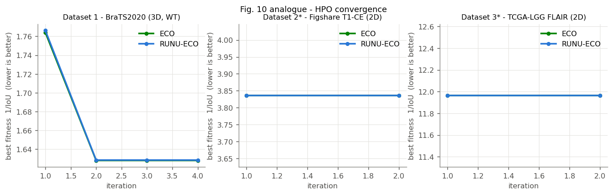

## ECO vs RUNU-ECO on benchmark functions (10-D, pop 10, 50 iters, 20 seeds; mean / median final value)

| Function | ECO | RUNU-ECO | Random search |
|---|---|---|---|
| sphere | 18.6 / 0.0204 | 209 / 0.0172 | 9.55e+03 / 9.53e+03 |
| rosenbrock | 849 / 9.04 | 354 / 8.99 | 1.05e+07 / 9.56e+06 |
| rastrigin | 14.3 / 0.0573 | 20.6 / 2.63 | 91.4 / 90.8 |
| ackley | 2.4 / 0.08 | 4.3 / 0.201 | 18.7 / 18.7 |
| griewank | 0.523 / 0.18 | 2.29 / 0.288 | 86.9 / 86.8 |
| schwefel_2_22 | 0.372 / 0.0362 | 0.226 / 0.0189 | 32.9 / 30.9 |

RUNU-ECO has the lower median on 3/6 functions.

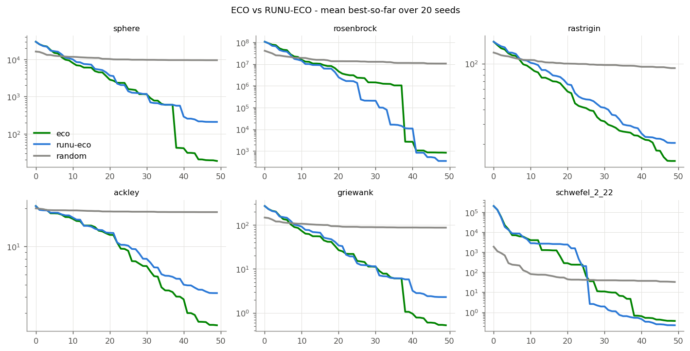

## Dataset 1 - BraTS2020 (3D, WT)

Folds completed: Efficient-UNet++=1, UNet=1, Efficient-UNet=1, UNet++=1, SVAEUnet++ (untuned)=1, UNet 3+=1, RUNU-ECO-SVAEUnet++=1

**Table 6 analogue - k-fold comparison**

| Model | Dice | Precision | Recall | Accuracy |
|---|---|---|---|---|
| UNet | 45.18 ± 24.42 | 32.92 ± 22.25 | 98.61 ± 2.50 | 94.46 ± 3.10 |
| UNet++ | 46.51 ± 24.13 | 34.04 ± 21.73 | 98.18 ± 3.28 | 94.70 ± 3.17 |
| UNet 3+ | 51.82 ± 25.10 | 39.60 ± 24.41 | 97.71 ± 3.27 | 95.91 ± 2.61 |
| RUNU-ECO-SVAEUnet++ | 66.24 ± 26.31 | 57.12 ± 29.62 | 95.67 ± 4.62 | 97.98 ± 1.71 |

**Table 7 analogue - statistics over test cases of the single CV fold**

| Metric | Model | Best | Worst | Mean | Median | Std |
|---|---|---|---|---|---|---|
| dice | UNet | 0.8247 | 0.0509 | 0.4518 | 0.3883 | 0.2442 |
| dice | UNet++ | 0.7981 | 0.0512 | 0.4651 | 0.4362 | 0.2413 |
| dice | UNet 3+ | 0.8610 | 0.0628 | 0.5182 | 0.4997 | 0.2510 |
| dice | Efficient-UNet | 0.6939 | 0.0423 | 0.3480 | 0.2782 | 0.2047 |
| dice | Efficient-UNet++ | 0.6108 | 0.0364 | 0.2970 | 0.2399 | 0.1782 |
| dice | SVAEUnet++ (untuned) | 0.7393 | 0.0429 | 0.3695 | 0.2982 | 0.2182 |
| dice | RUNU-ECO-SVAEUnet++ | 0.9534 | 0.0911 | 0.6624 | 0.7356 | 0.2631 |
| iou | UNet | 0.7016 | 0.0261 | 0.3260 | 0.2410 | 0.2188 |
| iou | UNet++ | 0.6640 | 0.0263 | 0.3361 | 0.2790 | 0.2126 |
| iou | UNet 3+ | 0.7559 | 0.0324 | 0.3894 | 0.3331 | 0.2365 |
| iou | Efficient-UNet | 0.5313 | 0.0216 | 0.2307 | 0.1616 | 0.1629 |
| iou | Efficient-UNet++ | 0.4397 | 0.0185 | 0.1881 | 0.1363 | 0.1320 |
| iou | SVAEUnet++ (untuned) | 0.5865 | 0.0219 | 0.2504 | 0.1752 | 0.1791 |
| iou | RUNU-ECO-SVAEUnet++ | 0.9109 | 0.0477 | 0.5485 | 0.5819 | 0.2753 |
| accuracy | UNet | 0.9811 | 0.8803 | 0.9446 | 0.9495 | 0.0310 |
| accuracy | UNet++ | 0.9801 | 0.8766 | 0.9470 | 0.9597 | 0.0317 |
| accuracy | UNet 3+ | 0.9861 | 0.9057 | 0.9591 | 0.9651 | 0.0261 |
| accuracy | Efficient-UNet | 0.9654 | 0.8577 | 0.9143 | 0.9074 | 0.0328 |
| accuracy | Efficient-UNet++ | 0.9499 | 0.8403 | 0.8918 | 0.8793 | 0.0342 |
| accuracy | SVAEUnet++ (untuned) | 0.9665 | 0.8608 | 0.9209 | 0.9162 | 0.0341 |
| accuracy | RUNU-ECO-SVAEUnet++ | 0.9966 | 0.9401 | 0.9798 | 0.9874 | 0.0171 |

**Table 8 analogue - ablation**

| Variant | Dice | IoU | Accuracy | Recall | F1 |
|---|---|---|---|---|---|
| Efficient-UNet | 34.80 ± 20.47 | 23.07 ± 16.29 | 91.43 ± 3.28 | 99.33 ± 1.61 | 34.80 ± 20.47 |
| Efficient-UNet++ | 29.70 ± 17.82 | 18.81 ± 13.20 | 89.18 ± 3.42 | 99.51 ± 1.28 | 29.70 ± 17.82 |
| SVAEUnet++ (untuned) | 36.95 ± 21.82 | 25.04 ± 17.91 | 92.09 ± 3.41 | 99.49 ± 1.12 | 36.95 ± 21.82 |
| RUNU-ECO-SVAEUnet++ | 66.24 ± 26.31 | 54.85 ± 27.53 | 97.98 ± 1.71 | 95.67 ± 4.62 | 66.24 ± 26.31 |

**Table 9 analogue - all indicators (mean over folds, %)**

| Metric | UNet | UNet++ | UNet 3+ | Efficient-UNet | Efficient-UNet++ | SVAEUnet++ (untuned) | RUNU-ECO-SVAEUnet++ |
|---|---|---|---|---|---|---|---|
| dice | 45.175 | 46.507 | 51.822 | 34.796 | 29.695 | 36.946 | 66.238 |
| iou | 32.603 | 33.613 | 38.936 | 23.070 | 18.812 | 25.041 | 54.853 |
| accuracy | 94.455 | 94.699 | 95.909 | 91.425 | 89.175 | 92.086 | 97.984 |
| sensitivity | 98.609 | 98.182 | 97.711 | 99.331 | 99.510 | 99.492 | 95.666 |
| specificity | 94.402 | 94.662 | 95.905 | 91.289 | 88.985 | 91.959 | 98.080 |
| precision | 32.920 | 34.039 | 39.603 | 23.152 | 18.855 | 25.108 | 57.120 |
| f1 | 45.175 | 46.507 | 51.822 | 34.796 | 29.695 | 36.946 | 66.238 |
| mcc | 51.876 | 52.856 | 57.459 | 42.924 | 38.363 | 44.841 | 69.720 |
| fpr | 5.598 | 5.338 | 4.095 | 8.711 | 11.015 | 8.041 | 1.920 |
| fnr | 1.391 | 1.818 | 2.289 | 0.669 | 0.490 | 0.508 | 4.334 |
| npv | 99.959 | 99.946 | 99.935 | 99.979 | 99.984 | 99.986 | 99.873 |
| fdr | 67.080 | 65.961 | 60.397 | 76.848 | 81.145 | 74.892 | 42.880 |

**Training settings actually used**

| Model | Epochs | Steps/epoch | LR | Hidden neurons | Train min/fold |
|---|---|---|---|---|---|
| UNet | 5 | 25 | 1.00e-03 | 128 | 1.3 |
| UNet++ | 5 | 25 | 1.00e-03 | 128 | 3.3 |
| UNet 3+ | 5 | 25 | 1.00e-03 | 128 | 6.0 |
| Efficient-UNet | 5 | 25 | 1.00e-03 | 128 | 0.9 |
| Efficient-UNet++ | 5 | 25 | 1.00e-03 | 128 | 1.7 |
| SVAEUnet++ (untuned) | 5 | 25 | 1.00e-03 | 128 | 1.9 |
| RUNU-ECO-SVAEUnet++ | 5 | 32 | 9.65e-03 | 95 | 2.4 |

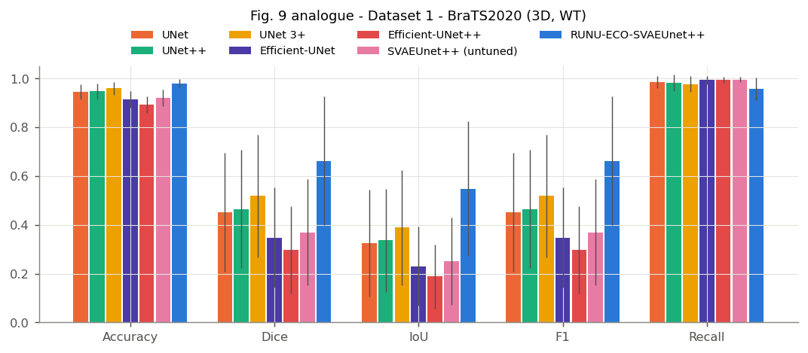

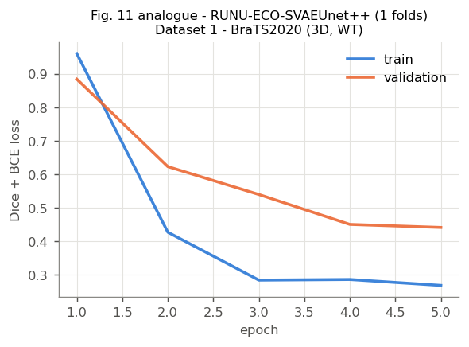

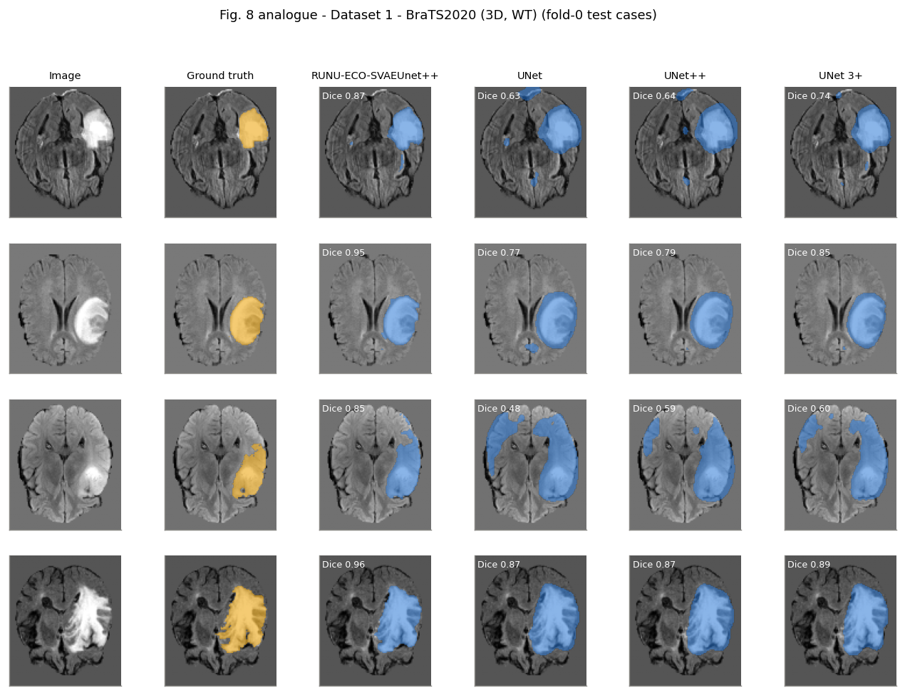

## Dataset 2* - Figshare T1-CE (2D)

Folds completed: Efficient-UNet++=1, UNet=1, Efficient-UNet=1, UNet++=1, SVAEUnet++ (untuned)=1, UNet 3+=1, RUNU-ECO-SVAEUnet++=1

**Table 6 analogue - k-fold comparison**

| Model | Dice | Precision | Recall | Accuracy |
|---|---|---|---|---|
| UNet | 39.40 ± 25.60 | 30.41 ± 23.83 | 76.69 ± 32.92 | 96.27 ± 1.90 |
| UNet++ | 40.91 ± 23.64 | 31.73 ± 22.03 | 76.67 ± 31.48 | 96.65 ± 1.74 |
| UNet 3+ | 45.84 ± 27.89 | 39.83 ± 27.13 | 67.29 ± 36.49 | 97.71 ± 1.52 |
| RUNU-ECO-SVAEUnet++ | 55.87 ± 30.08 | 59.13 ± 33.31 | 62.58 ± 34.42 | 98.58 ± 1.23 |

**Table 7 analogue - statistics over test cases of the single CV fold**

| Metric | Model | Best | Worst | Mean | Median | Std |
|---|---|---|---|---|---|---|
| dice | UNet | 0.8600 | 0.0000 | 0.3940 | 0.4038 | 0.2560 |
| dice | UNet++ | 0.8569 | 0.0000 | 0.4091 | 0.3981 | 0.2364 |
| dice | UNet 3+ | 0.8970 | 0.0000 | 0.4584 | 0.5185 | 0.2789 |
| dice | Efficient-UNet | 0.9276 | 0.0000 | 0.4445 | 0.4499 | 0.2733 |
| dice | Efficient-UNet++ | 0.6858 | 0.0000 | 0.2505 | 0.2264 | 0.1652 |
| dice | SVAEUnet++ (untuned) | 0.8545 | 0.0000 | 0.3729 | 0.3768 | 0.2300 |
| dice | RUNU-ECO-SVAEUnet++ | 0.9596 | 0.0000 | 0.5587 | 0.6187 | 0.3008 |
| iou | UNet | 0.7544 | 0.0000 | 0.2789 | 0.2530 | 0.2132 |
| iou | UNet++ | 0.7497 | 0.0000 | 0.2860 | 0.2485 | 0.1957 |
| iou | UNet 3+ | 0.8133 | 0.0000 | 0.3399 | 0.3500 | 0.2385 |
| iou | Efficient-UNet | 0.8650 | 0.0000 | 0.3275 | 0.2902 | 0.2406 |
| iou | Efficient-UNet++ | 0.5218 | 0.0000 | 0.1542 | 0.1276 | 0.1172 |
| iou | SVAEUnet++ (untuned) | 0.7459 | 0.0000 | 0.2548 | 0.2322 | 0.1833 |
| iou | RUNU-ECO-SVAEUnet++ | 0.9223 | 0.0000 | 0.4458 | 0.4479 | 0.2832 |
| accuracy | UNet | 0.9900 | 0.8995 | 0.9627 | 0.9674 | 0.0190 |
| accuracy | UNet++ | 0.9894 | 0.9065 | 0.9665 | 0.9711 | 0.0174 |
| accuracy | UNet 3+ | 0.9962 | 0.9152 | 0.9771 | 0.9814 | 0.0152 |
| accuracy | Efficient-UNet | 0.9958 | 0.9182 | 0.9721 | 0.9776 | 0.0174 |
| accuracy | Efficient-UNet++ | 0.9733 | 0.8506 | 0.9165 | 0.9176 | 0.0254 |
| accuracy | SVAEUnet++ (untuned) | 0.9877 | 0.8989 | 0.9588 | 0.9634 | 0.0186 |
| accuracy | RUNU-ECO-SVAEUnet++ | 0.9988 | 0.9272 | 0.9858 | 0.9891 | 0.0123 |

**Table 8 analogue - ablation**

| Variant | Dice | IoU | Accuracy | Recall | F1 |
|---|---|---|---|---|---|
| Efficient-UNet | 44.45 ± 27.33 | 32.75 ± 24.06 | 97.21 ± 1.74 | 69.82 ± 32.81 | 44.45 ± 27.33 |
| Efficient-UNet++ | 25.05 ± 16.52 | 15.42 ± 11.72 | 91.65 ± 2.54 | 83.96 ± 24.39 | 25.05 ± 16.52 |
| SVAEUnet++ (untuned) | 37.29 ± 23.00 | 25.48 ± 18.33 | 95.88 ± 1.86 | 77.37 ± 31.30 | 37.29 ± 23.00 |
| RUNU-ECO-SVAEUnet++ | 55.87 ± 30.08 | 44.58 ± 28.32 | 98.58 ± 1.23 | 62.58 ± 34.42 | 55.87 ± 30.08 |

**Table 9 analogue - all indicators (mean over folds, %)**

| Metric | UNet | UNet++ | UNet 3+ | Efficient-UNet | Efficient-UNet++ | SVAEUnet++ (untuned) | RUNU-ECO-SVAEUnet++ |
|---|---|---|---|---|---|---|---|
| dice | 39.397 | 40.915 | 45.838 | 44.445 | 25.050 | 37.288 | 55.868 |
| iou | 27.890 | 28.596 | 33.994 | 32.745 | 15.419 | 25.483 | 44.579 |
| accuracy | 96.273 | 96.652 | 97.712 | 97.212 | 91.649 | 95.877 | 98.577 |
| sensitivity | 76.691 | 76.672 | 67.292 | 69.820 | 83.964 | 77.367 | 62.585 |
| specificity | 96.715 | 97.123 | 98.364 | 97.841 | 91.891 | 96.326 | 99.415 |
| precision | 30.406 | 31.725 | 39.833 | 38.118 | 16.120 | 27.813 | 59.133 |
| f1 | 39.397 | 40.915 | 45.838 | 44.445 | 25.050 | 37.288 | 55.868 |
| mcc | 43.919 | 45.252 | 48.238 | 47.394 | 32.076 | 42.079 | 57.575 |
| fpr | 3.285 | 2.877 | 1.636 | 2.159 | 8.109 | 3.674 | 0.585 |
| fnr | 23.309 | 23.328 | 32.708 | 30.180 | 16.036 | 22.633 | 37.415 |
| npv | 99.484 | 99.460 | 99.301 | 99.313 | 99.574 | 99.461 | 99.139 |
| fdr | 69.594 | 68.275 | 60.167 | 61.882 | 83.880 | 72.187 | 40.867 |

**Training settings actually used**

| Model | Epochs | Steps/epoch | LR | Hidden neurons | Train min/fold |
|---|---|---|---|---|---|
| UNet | 5 | 25 | 1.00e-03 | 128 | 0.3 |
| UNet++ | 5 | 25 | 1.00e-03 | 128 | 0.7 |
| UNet 3+ | 5 | 25 | 1.00e-03 | 128 | 1.0 |
| Efficient-UNet | 5 | 25 | 1.00e-03 | 128 | 0.6 |
| Efficient-UNet++ | 5 | 25 | 1.00e-03 | 128 | 1.0 |
| SVAEUnet++ (untuned) | 5 | 25 | 1.00e-03 | 128 | 1.5 |
| RUNU-ECO-SVAEUnet++ | 5 | 50 | 3.79e-03 | 244 | 2.2 |

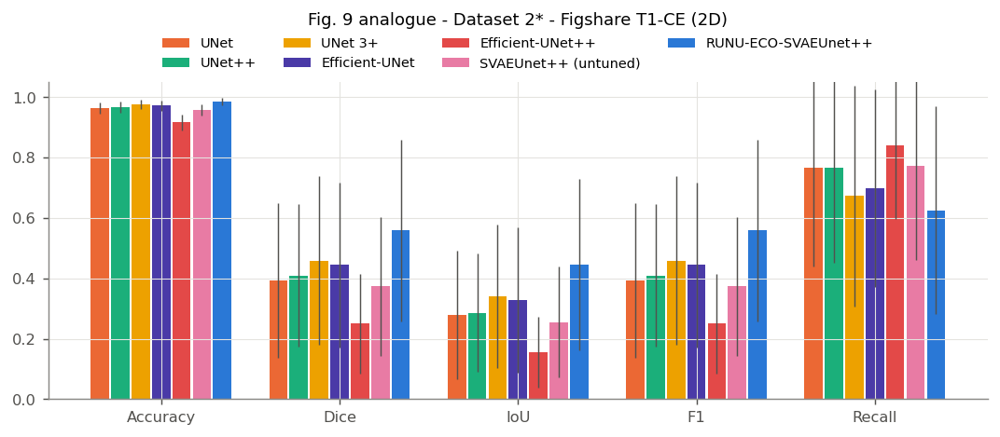

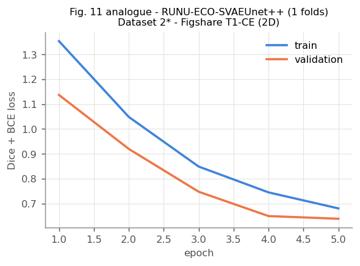

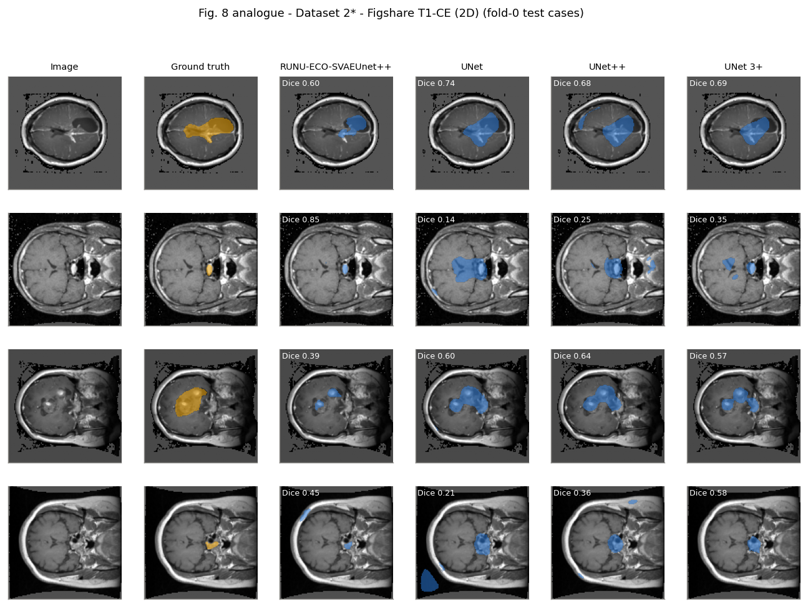

## Dataset 3* - TCGA-LGG FLAIR (2D)

Folds completed: Efficient-UNet++=1, UNet=1, Efficient-UNet=1, UNet++=1, SVAEUnet++ (untuned)=1, UNet 3+=1, RUNU-ECO-SVAEUnet++=1

**Table 6 analogue - k-fold comparison**

| Model | Dice | Precision | Recall | Accuracy |
|---|---|---|---|---|
| UNet | 19.81 ± 31.49 | 17.88 ± 30.39 | 88.02 ± 25.88 | 97.42 ± 3.19 |
| UNet++ | 15.63 ± 26.64 | 13.23 ± 23.91 | 89.76 ± 24.16 | 97.45 ± 2.30 |
| UNet 3+ | 38.34 ± 41.84 | 38.50 ± 42.41 | 87.80 ± 26.16 | 97.90 ± 2.47 |
| RUNU-ECO-SVAEUnet++ | 34.75 ± 40.59 | 35.58 ± 41.28 | 88.20 ± 25.01 | 98.55 ± 1.59 |

*LGG, tumour-positive slices only* (in the table above a tumour-free slice scores 1 only if nothing is predicted, else 0)

| Model | Dice | IoU | Precision | Recall |
|---|---|---|---|---|
| UNet | 42.92 ± 26.85 | 31.28 ± 23.51 | 37.34 ± 27.58 | 65.29 ± 33.94 |
| UNet++ | 45.30 ± 26.69 | 33.20 ± 23.00 | 38.36 ± 26.34 | 70.31 ± 33.38 |
| UNet 3+ | 44.48 ± 26.29 | 32.32 ± 22.29 | 44.93 ± 28.70 | 64.64 ± 34.13 |
| Efficient-UNet | 45.13 ± 25.78 | 32.87 ± 22.78 | 40.00 ± 25.87 | 62.48 ± 33.32 |
| Efficient-UNet++ | 35.72 ± 20.86 | 23.76 ± 16.01 | 25.14 ± 17.28 | 82.32 ± 25.98 |
| SVAEUnet++ (untuned) | 44.42 ± 25.97 | 32.18 ± 22.02 | 36.83 ± 25.00 | 69.28 ± 33.45 |
| RUNU-ECO-SVAEUnet++ | 52.90 ± 26.37 | 40.15 ± 23.73 | 55.30 ± 27.69 | 65.81 ± 32.37 |

**Table 7 analogue - statistics over test cases of the single CV fold**

| Metric | Model | Best | Worst | Mean | Median | Std |
|---|---|---|---|---|---|---|
| dice | UNet | 1.0000 | 0.0000 | 0.1981 | 0.0000 | 0.3149 |
| dice | UNet++ | 0.8751 | 0.0000 | 0.1563 | 0.0000 | 0.2664 |
| dice | UNet 3+ | 1.0000 | 0.0000 | 0.3834 | 0.2181 | 0.4184 |
| dice | Efficient-UNet | 0.9012 | 0.0000 | 0.1557 | 0.0000 | 0.2626 |
| dice | Efficient-UNet++ | 0.7855 | 0.0000 | 0.1232 | 0.0000 | 0.2094 |
| dice | SVAEUnet++ (untuned) | 0.8757 | 0.0000 | 0.1532 | 0.0000 | 0.2605 |
| dice | RUNU-ECO-SVAEUnet++ | 1.0000 | 0.0000 | 0.3475 | 0.0000 | 0.4059 |
| iou | UNet | 1.0000 | 0.0000 | 0.1579 | 0.0000 | 0.2791 |
| iou | UNet++ | 0.7779 | 0.0000 | 0.1145 | 0.0000 | 0.2077 |
| iou | UNet 3+ | 1.0000 | 0.0000 | 0.3415 | 0.1224 | 0.4081 |
| iou | Efficient-UNet | 0.8202 | 0.0000 | 0.1134 | 0.0000 | 0.2057 |
| iou | Efficient-UNet++ | 0.6467 | 0.0000 | 0.0820 | 0.0000 | 0.1470 |
| iou | SVAEUnet++ (untuned) | 0.7789 | 0.0000 | 0.1110 | 0.0000 | 0.2003 |
| iou | RUNU-ECO-SVAEUnet++ | 1.0000 | 0.0000 | 0.3035 | 0.0000 | 0.3846 |
| accuracy | UNet | 1.0000 | 0.8677 | 0.9742 | 0.9889 | 0.0319 |
| accuracy | UNet++ | 0.9982 | 0.9047 | 0.9745 | 0.9821 | 0.0230 |
| accuracy | UNet 3+ | 1.0000 | 0.9009 | 0.9790 | 0.9877 | 0.0247 |
| accuracy | Efficient-UNet | 0.9990 | 0.8678 | 0.9729 | 0.9785 | 0.0220 |
| accuracy | Efficient-UNet++ | 0.9848 | 0.7869 | 0.9211 | 0.9203 | 0.0295 |
| accuracy | SVAEUnet++ (untuned) | 0.9948 | 0.9141 | 0.9659 | 0.9692 | 0.0185 |
| accuracy | RUNU-ECO-SVAEUnet++ | 1.0000 | 0.9194 | 0.9855 | 0.9899 | 0.0159 |

**Table 8 analogue - ablation**

| Variant | Dice | IoU | Accuracy | Recall | F1 |
|---|---|---|---|---|---|
| Efficient-UNet | 15.57 ± 26.26 | 11.34 ± 20.57 | 97.29 ± 2.20 | 87.06 ± 26.48 | 15.57 ± 26.26 |
| Efficient-UNet++ | 12.32 ± 20.94 | 8.20 ± 14.70 | 92.11 ± 2.95 | 93.90 ± 17.42 | 12.32 ± 20.94 |
| SVAEUnet++ (untuned) | 15.32 ± 26.05 | 11.10 ± 20.03 | 96.59 ± 1.85 | 89.40 ± 24.48 | 15.32 ± 26.05 |
| RUNU-ECO-SVAEUnet++ | 34.75 ± 40.59 | 30.35 ± 38.46 | 98.55 ± 1.59 | 88.20 ± 25.01 | 34.75 ± 40.59 |

**Table 9 analogue - all indicators (mean over folds, %)**

| Metric | UNet | UNet++ | UNet 3+ | Efficient-UNet | Efficient-UNet++ | SVAEUnet++ (untuned) | RUNU-ECO-SVAEUnet++ |
|---|---|---|---|---|---|---|---|
| dice | 19.806 | 15.629 | 38.345 | 15.571 | 12.325 | 15.324 | 34.750 |
| iou | 15.793 | 11.454 | 34.149 | 11.342 | 8.198 | 11.100 | 30.352 |
| accuracy | 97.417 | 97.449 | 97.904 | 97.293 | 92.110 | 96.593 | 98.555 |
| sensitivity | 88.024 | 89.756 | 87.801 | 87.055 | 93.902 | 89.401 | 88.204 |
| specificity | 97.713 | 97.703 | 98.213 | 97.606 | 92.215 | 96.860 | 98.892 |
| precision | 17.882 | 13.233 | 38.499 | 13.799 | 8.674 | 12.706 | 35.579 |
| f1 | 19.806 | 15.629 | 38.345 | 15.571 | 12.325 | 15.324 | 34.750 |
| mcc | 20.524 | 16.466 | 39.015 | 16.003 | 13.996 | 16.065 | 35.261 |
| fpr | 2.287 | 2.297 | 1.787 | 2.394 | 7.785 | 3.140 | 1.108 |
| fnr | 11.976 | 10.244 | 12.199 | 12.945 | 6.098 | 10.599 | 11.796 |
| npv | 99.652 | 99.704 | 99.653 | 99.641 | 99.814 | 99.690 | 99.638 |
| fdr | 82.118 | 86.767 | 61.501 | 86.201 | 91.326 | 87.294 | 64.421 |

**Training settings actually used**

| Model | Epochs | Steps/epoch | LR | Hidden neurons | Train min/fold |
|---|---|---|---|---|---|
| UNet | 5 | 25 | 1.00e-03 | 128 | 0.4 |
| UNet++ | 5 | 25 | 1.00e-03 | 128 | 0.7 |
| UNet 3+ | 5 | 25 | 1.00e-03 | 128 | 1.0 |
| Efficient-UNet | 5 | 25 | 1.00e-03 | 128 | 0.7 |
| Efficient-UNet++ | 5 | 25 | 1.00e-03 | 128 | 1.2 |
| SVAEUnet++ (untuned) | 5 | 25 | 1.00e-03 | 128 | 2.2 |
| RUNU-ECO-SVAEUnet++ | 5 | 23 | 1.64e-03 | 21 | 2.2 |

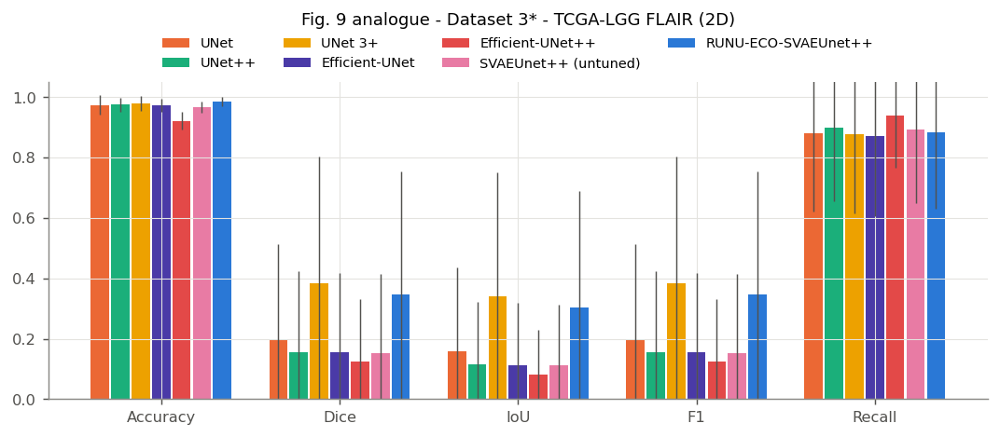

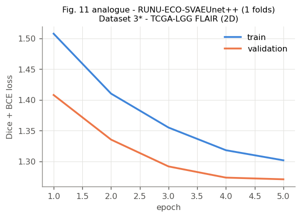

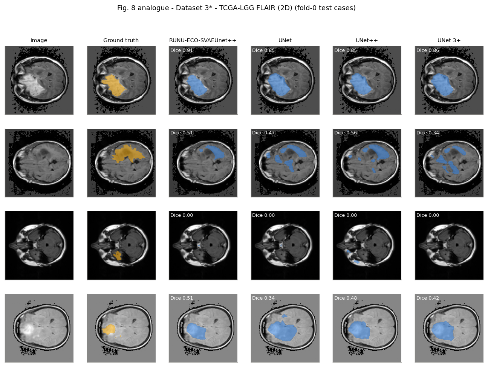
